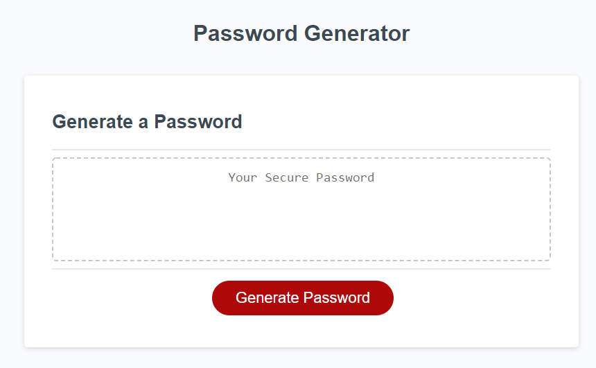
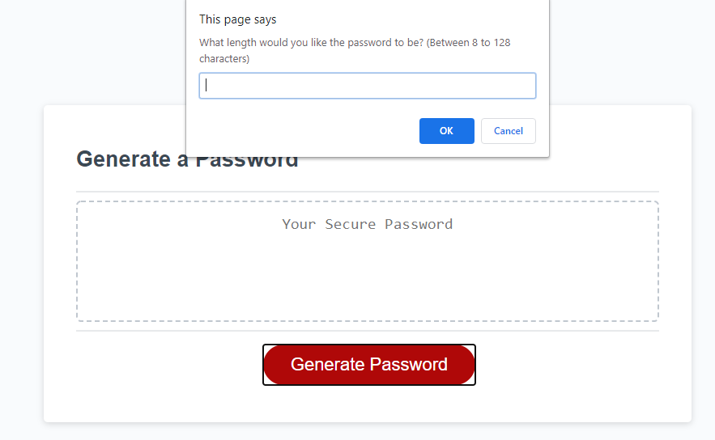

## 03 Password Generator

## Description

This project solves the security concern of weak passwords. Given that a user needs a new, secured password, they will be promted to determine certain character types required for the password and then a new random password will be generated.

The new password implements greater security to sensitive data and saves time for users.

The criteria that the password is able to meet are:  

1) the password is between 8 - 128 characters long, AND  

2) the password must have at least one of the following character types:  
    *lowercase characters  
    *uppercasse characters  
    *special characters  
    *numeric characters  

## The final product
 
 https://ikkhan18.github.io/IK-JSPG-041020/

  
  

## My notes

I found this assignment quite challenging. But I learned a lot from this assignment specialy in javascrip and am happy with the result.  It can be many changes and improvment on this layout but will be on later stage.
